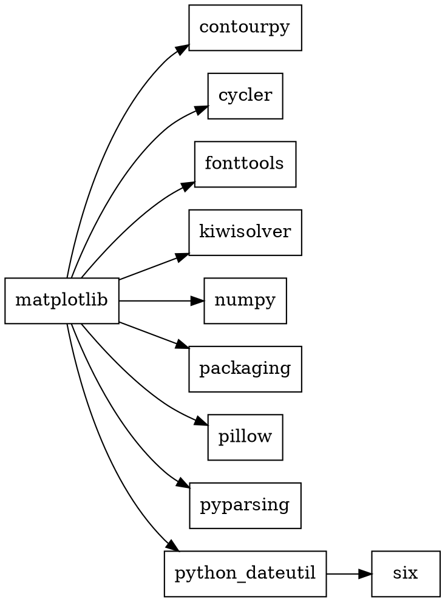
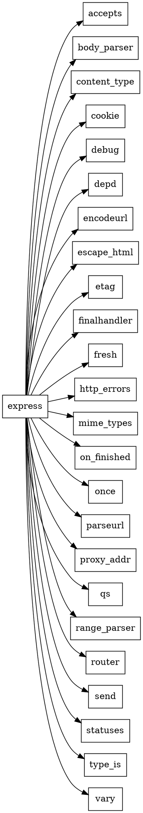

# Практическое задание №2. Менеджеры пакетов
## Задача 1
Вывести служебную информацию о пакете matplotlib (Python). Разобрать основные элементы содержимого файла со служебной информацией из пакета. Как получить пакет без менеджера пакетов, прямо из репозитория?

### Команда:
```bash
pip3 show matplotlib
```
### Результат:
```bash
Name: matplotlib
Version: 3.10.6
Summary: Python plotting package
Home-page: https://matplotlib.org
Author: John D. Hunter, Michael Droettboom
Author-email: matplotlib-users@python.org
License: License agreement for matplotlib versions 1.3.0 and later
Location: /opt/anaconda3/lib/python3.13/site-packages
Requires: contourpy, cycler, fonttools, kiwisolver, numpy, packaging, pillow, pyparsing, python-dateutil
Required-by: ipympl, seaborn
```
### Как получить пакет без менеджера пакетов:

Зайти на сайт **PyPI** (https://pypi.org/project/matplotlib/), перейти на вкладку **Release files** и скачать нужный файл:

- **`.whl`** (wheel) — готовый бинарный пакет для конкретной системы (например, `matplotlib-3.11.2-cp313-cp313-macosx_11_0_arm64.whl` для Mac на Apple Silicon).
- **`.tar.gz`** — исходный код, который можно собрать вручную.

Затем установить вручную:

```bash
pip3 install matplotlib-3.11.2-cp313-cp313-macosx_11_0_arm64.whl
```
Или распаковать `.tar.gz` и выполнить:
```bash
python3 setup.py install
```


## Задача 2
Вывести служебную информацию о пакете express (JavaScript). Разобрать основные элементы содержимого файла со служебной информацией из пакета. Как получить пакет без менеджера пакетов, прямо из репозитория?

### Команда:
```bash
npm view express
```
### Результат:
```bash
express@5.2.1 | MIT | deps: 28 | versions: 289
Fast, unopinionated, minimalist web framework
https://expressjs.com/

keywords: express, framework, sinatra, web, http, rest, restful, router, app, api

dist
.tarball: https://registry.npmjs.org/express/-/express-5.2.1.tgz
.shasum: 8f21d15b6d327f92b4794ecf8cb08a72f956ac04
.integrity: sha512-hIS4idWWai69NezIdRt2xFVofaF4j+6INOpJlVOLDO8zXGpUVEVzIYk12UUi2JzjEzWL3IOAxcTubgz9Po0yXw==
.unpackedSize: 75.4 kB

dependencies:
accepts: ^2.0.0      etag: ^1.8.1         proxy-addr: ^2.0.7
body-parser: ^2.2.1  finalhandler: ^2.1.0 qs: ^6.14.0
content-type: ^1.0.5 fresh: ^2.0.0        range-parser: ^1.2.1
cookie: ^0.7.1       http-errors: ^2.0.0  router: ^2.2.0
debug: ^4.4.0        mime-types: ^3.0.0   send: ^1.1.0
depd: ^2.0.0         on-finished: ^2.4.1  statuses: ^2.0.1
encodeurl: ^2.0.0    once: ^1.4.0         type-is: ^2.0.1
escape-html: ^1.0.3  parseurl: ^1.3.3     vary: ^1.1.2

maintainers:
- wesleytodd <wes@wesleytodd.com>
- jonchurch <npm@jonchurch.com>
- ctcpip <c@labsector.com>
- ulisesgascon <ulisesgascondev@gmail.com>
- sheplu <jean.burellier@gmail.com>

dist-tags:
latest-4: 4.22.3  latest: 5.2.1
```

### Как получить пакет без менеджера пакетов:

Зайти на сайт npm (https://www.npmjs.com/package/express), перейти на вкладку Code или сразу скачать .tgz-архив по прямой ссылке из поля .tarball:

```bash
wget https://registry.npmjs.org/express/-/express-5.2.1.tgz
```
Затем распаковать и использовать:

```bash
tar -xzf express-5.2.1.tgz
cd package
```
## Задача 3
Сформировать graphviz-код и получить изображения зависимостей matplotlib и express.

### Код (matplotlib.dot):

### Код (express.dot):

### Генерация изображений:
```bash
dot -Tpng matplotlib.dot -o matplotlib.png
dot -Tpng express.dot -o express.png
```
### Просмотр изображений:
```bash
open matplotlib.png
open express.png
```
### Результат:
https://matplotlib.png/
https://express.png/

## Задача 4
Изучить основы программирования в ограничениях. Установить MiniZinc, разобраться с основами его синтаксиса и работы в IDE.

Решить на MiniZinc задачу о счастливых билетах. Добавить ограничение на то, что все цифры билета должны быть различными (подсказка: используйте all_different). Найти минимальное решение для суммы 3 цифр.

### Код:
```minizinc
include "globals.mzn";

% Задача о счастливых билетах
% Билет: 6 цифр, сумма первых 3 = сумме последних 3
% Все цифры различны
% Найти минимальную сумму 3 цифр

array[1..6] of var 0..9: digits;

% Все цифры различны
constraint all_different(digits);

% Сумма первых трех равна сумме последних трех
constraint sum(digits[1..3]) == sum(digits[4..6]);

% Ищем минимальную сумму
solve minimize sum(digits[1..3]);

% Вывод результата
output [
    "Билет: \(digits[1])\(digits[2])\(digits[3])-\(digits[4])\(digits[5])\(digits[6])\n",
    "Сумма: \(sum(digits[1..3]))\n"
];
```

### Результат:
```text
Билет: 620-431
Сумма: 8
```
## Задача 5
Решить на MiniZinc задачу о зависимостях пакетов для рисунка pubgrub.png.

### Анализ зависимостей:
- `root` зависит от `menu` и `icons`
- `menu` версии 1.1.0–1.5.0 зависит от `dropdown`
- `dropdown` зависит от `icons`
- `icons` не имеет зависимостей

### Код:
```minizinc
include "globals.mzn";

% Версии пакетов (0 = не установлен)
var 0..1: root;
var 0..6: menu;      % 1.0.0=1, 1.1.0=2, 1.2.0=3, 1.3.0=4, 1.4.0=5, 1.5.0=6
var 0..5: dropdown;  % 1.8.0=1, 2.0.0=2, 2.1.0=3, 2.2.0=4, 2.3.0=5
var 0..2: icons;     % 1.0.0=1, 2.0.0=2

% root всегда установлен
constraint root = 1;

% root зависит от menu
constraint menu >= 1;

% root зависит от icons
constraint icons >= 1;

% menu 1.1.0 - 1.5.0 зависит от dropdown
constraint (menu >= 2) -> (dropdown >= 1);

% dropdown зависит от icons
constraint (dropdown >= 1) -> (icons >= 1);

% Если dropdown не нужен, он не установлен
constraint (menu < 2) -> (dropdown = 0);

solve satisfy;

output [
    "root = 1.0.0\n",
    "menu = \(menu)\n",
    "dropdown = \(dropdown)\n",
    "icons = \(icons)\n"
];
```
### Результат:
```text
root = 1.0.0
menu = 1
dropdown = 0
icons = 1
```

## Задача 6

Решить на MiniZinc задачу о зависимостях пакетов для следующих данных:
```text
root 1.0.0 зависит от foo ^1.0.0 и target ^2.0.0.
foo 1.1.0 зависит от left ^1.0.0 и right ^1.0.0.
foo 1.0.0 не имеет зависимостей.
left 1.0.0 зависит от shared >=1.0.0.
right 1.0.0 зависит от shared <2.0.0.
shared 2.0.0 не имеет зависимостей.
shared 1.0.0 зависит от target ^1.0.0.
target 2.0.0 и 1.0.0 не имеют зависимостей.
```


### Код:
```minizinc
include "globals.mzn";

% Версии пакетов (0 = не установлен)
var 0..1: root;      % 1.0.0 = 1
var 0..2: foo;       % 1.0.0 = 1, 1.1.0 = 2
var 0..1: left;      % 1.0.0 = 1
var 0..1: right;     % 1.0.0 = 1
var 0..2: shared;    % 1.0.0 = 1, 2.0.0 = 2
var 0..2: target;    % 1.0.0 = 1, 2.0.0 = 2

% root всегда установлен
constraint root = 1;

% root зависит от foo ^1.0.0 (foo = 1 или 2)
constraint foo >= 1;

% root зависит от target ^2.0.0 (target = 2)
constraint target = 2;

% foo 1.1.0 (=2) зависит от left и right
constraint (foo = 2) -> (left = 1);
constraint (foo = 2) -> (right = 1);

% left зависит от shared >= 1.0.0
constraint (left = 1) -> (shared >= 1);

% right зависит от shared < 2.0.0
constraint (right = 1) -> (shared < 2);

% shared 1.0.0 зависит от target ^1.0.0
constraint (shared = 1) -> (target = 1);

% Если foo 1.0.0, то left, right, shared не нужны
constraint (foo = 1) -> (left = 0);
constraint (foo = 1) -> (right = 0);
constraint (foo = 1) -> (shared = 0);

solve satisfy;

output [
    "root = 1.0.0\n",
    "foo = \(foo)\n",
    "left = \(left)\n",
    "right = \(right)\n",
    "shared = \(shared)\n",
    "target = \(target)\n"
];
```

### Результат:
```text
root = 1.0.0
foo = 1
left = 0
right = 0
shared = 0
target = 2
```

## Задача 7
Представить задачу о зависимостях пакетов в общей форме. Необходимо действовать аналогично реальному менеджеру пакетов: получить описание пакета и его зависимости в виде структуры данных (например, словаря). Систему ограничений нужно построить автоматически по метаданным.

### Идея решения:
Написать программу на Python, которая:
1. Хранит описание пакетов и их зависимостей в виде словаря.
2. Автоматически генерирует код MiniZinc на основе этого словаря.
3. Сохраняет сгенерированный код в файл `generated.mzn`.

### Код (generate_mzn.py):
```python
# Метаданные пакетов: имя -> {версия: [список зависимостей]}
packages = {
    "root":   {"1.0.0": ["foo ^1.0.0", "target ^2.0.0"]},
    "foo":    {"1.1.0": ["left ^1.0.0", "right ^1.0.0"],
               "1.0.0": []},
    "left":   {"1.0.0": ["shared >=1.0.0"]},
    "right":  {"1.0.0": ["shared <2.0.0"]},
    "shared": {"2.0.0": [],
               "1.0.0": ["target ^1.0.0"]},
    "target": {"2.0.0": [],
               "1.0.0": []},
}

# Соответствие версий числам (для MiniZinc)
version_numbers = {
    "root":   {"1.0.0": 1},
    "foo":    {"1.0.0": 1, "1.1.0": 2},
    "left":   {"1.0.0": 1},
    "right":  {"1.0.0": 1},
    "shared": {"1.0.0": 1, "2.0.0": 2},
    "target": {"1.0.0": 1, "2.0.0": 2},
}

def parse_dep(dep):
    """Разбирает строку зависимости: 'foo ^1.0.0' -> ('foo', '^', '1.0.0')"""
    parts = dep.split()
    name = parts[0]
    spec = parts[1]
    if spec.startswith(">="):
        return name, ">=", spec[2:]
    elif spec.startswith("<="):
        return name, "<=", spec[2:]
    elif spec.startswith("^"):
        return name, "^", spec[1:]
    elif spec.startswith(">"):
        return name, ">", spec[1:]
    elif spec.startswith("<"):
        return name, "<", spec[1:]
    else:
        return name, "=", spec

def gen_constraint(pkg, ver, dep):
    """Генерирует строку ограничения MiniZinc для одной зависимости"""
    name, op, version = parse_dep(dep)
    v = version_numbers[name][version]
    pv = version_numbers[pkg][ver]

    if op == "^":
        max_v = v + 1
        return f"constraint ({pkg} = {pv}) -> ({name} >= {v} /\\ {name} < {max_v});"
    elif op == ">=":
        return f"constraint ({pkg} = {pv}) -> ({name} >= {v});"
    elif op == "<":
        return f"constraint ({pkg} = {pv}) -> ({name} < {v});"
    elif op == "<=":
        return f"constraint ({pkg} = {pv}) -> ({name} <= {v});"
    elif op == ">":
        return f"constraint ({pkg} = {pv}) -> ({name} > {v});"
    else:
        return f"constraint ({pkg} = {pv}) -> ({name} = {v});"

# Генерируем код MiniZinc
lines = []
lines.append('include "globals.mzn";\n')
lines.append("% Автоматически сгенерированные ограничения\n")

# Объявления переменных
for pkg, versions in version_numbers.items():
    max_v = max(versions.values())
    lines.append(f"var 0..{max_v}: {pkg};")

lines.append("")
lines.append("% root всегда установлен")
lines.append("constraint root = 1;\n")

for pkg, versions in packages.items():
    for ver, deps in versions.items():
        for dep in deps:
            lines.append(gen_constraint(pkg, ver, dep))

lines.append("")
lines.append("solve satisfy;\n")

# Вывод
lines.append("output [")
for pkg in version_numbers:
    lines.append(f'    "{pkg} = \\({pkg})\\n",')
lines.append("];")

# Сохраняем в файл
with open("generated.mzn", "w") as f:
    f.write("\n".join(lines))

print("Файл generated.mzn создан!")
```

### Сгенерированный код (generated.mzn):
```python
include "globals.mzn";

% Автоматически сгенерированные ограничения

var 0..1: root;
var 0..2: foo;
var 0..1: left;
var 0..1: right;
var 0..2: shared;
var 0..2: target;

% root всегда установлен
constraint root = 1;

constraint (root = 1) -> (foo >= 1 /\ foo < 2);
constraint (root = 1) -> (target >= 2 /\ target < 3);
constraint (foo = 2) -> (left >= 1 /\ left < 2);
constraint (foo = 2) -> (right >= 1 /\ right < 2);
constraint (left = 1) -> (shared >= 1);
constraint (right = 1) -> (shared < 2);
constraint (shared = 1) -> (target >= 1 /\ target < 2);

solve satisfy;

output [
    "root = \(root)\n",
    "foo = \(foo)\n",
    "left = \(left)\n",
    "right = \(right)\n",
    "shared = \(shared)\n",
    "target = \(target)\n",
];
```

### Результат:
```text
root = 1
foo = 1
left = 0
right = 0
shared = 0
target = 2
```
