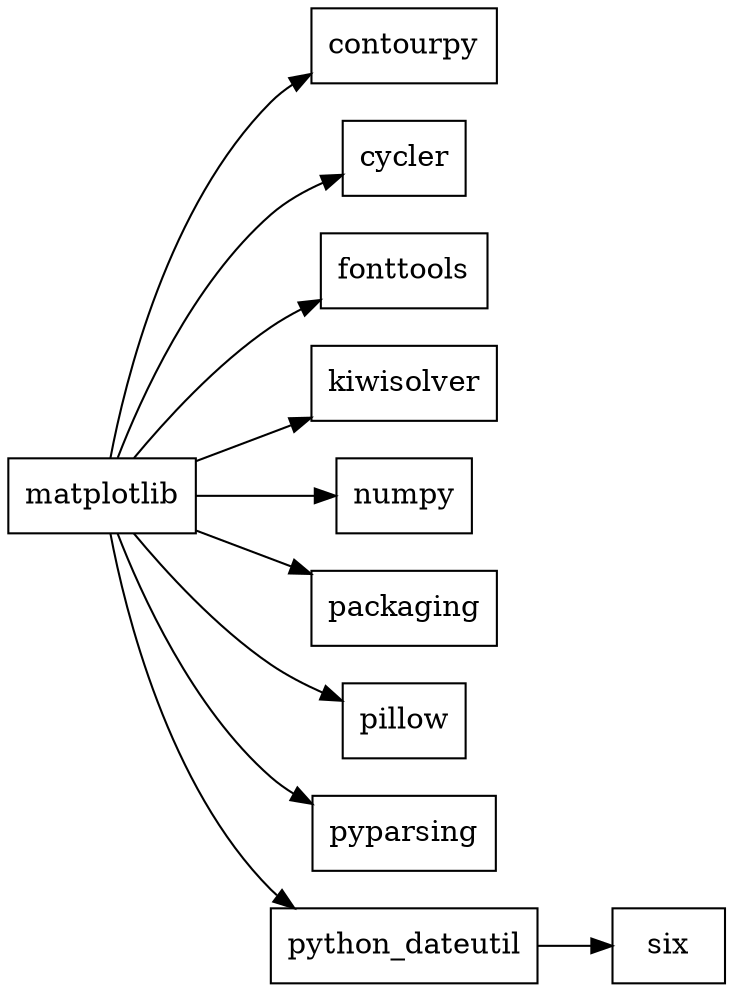
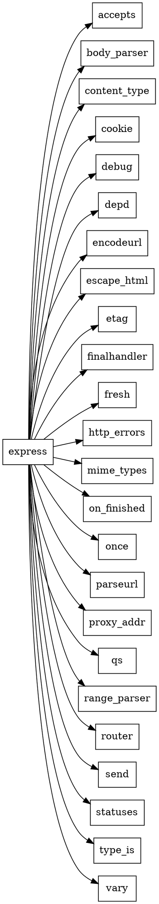

# Практическое задание №2. Менеджеры пакетов
## Задача 1
Вывести служебную информацию о пакете matplotlib (Python). Разобрать основные элементы содержимого файла со служебной информацией из пакета. Как получить пакет без менеджера пакетов, прямо из репозитория?

### Команда:
```bash
pip3 show matplotlib
```
### Результат:
```bash
Name: matplotlib
Version: 3.10.6
Summary: Python plotting package
Home-page: https://matplotlib.org
Author: John D. Hunter, Michael Droettboom
Author-email: matplotlib-users@python.org
License: License agreement for matplotlib versions 1.3.0 and later
Location: /opt/anaconda3/lib/python3.13/site-packages
Requires: contourpy, cycler, fonttools, kiwisolver, numpy, packaging, pillow, pyparsing, python-dateutil
Required-by: ipympl, seaborn
```
### Как получить пакет без менеджера пакетов:

Зайти на сайт **PyPI** (https://pypi.org/project/matplotlib/), перейти на вкладку **Release files** и скачать нужный файл:

- **`.whl`** (wheel) — готовый бинарный пакет для конкретной системы (например, `matplotlib-3.11.2-cp313-cp313-macosx_11_0_arm64.whl` для Mac на Apple Silicon).
- **`.tar.gz`** — исходный код, который можно собрать вручную.

Затем установить вручную:

```bash
pip3 install matplotlib-3.11.2-cp313-cp313-macosx_11_0_arm64.whl
```
Или распаковать `.tar.gz` и выполнить:
```bash
python3 setup.py install
```


## Задача 2
Вывести служебную информацию о пакете express (JavaScript). Разобрать основные элементы содержимого файла со служебной информацией из пакета. Как получить пакет без менеджера пакетов, прямо из репозитория?

### Команда:
```bash
npm view express
```
### Результат:
```bash
express@5.2.1 | MIT | deps: 28 | versions: 289
Fast, unopinionated, minimalist web framework
https://expressjs.com/

keywords: express, framework, sinatra, web, http, rest, restful, router, app, api

dist
.tarball: https://registry.npmjs.org/express/-/express-5.2.1.tgz
.shasum: 8f21d15b6d327f92b4794ecf8cb08a72f956ac04
.integrity: sha512-hIS4idWWai69NezIdRt2xFVofaF4j+6INOpJlVOLDO8zXGpUVEVzIYk12UUi2JzjEzWL3IOAxcTubgz9Po0yXw==
.unpackedSize: 75.4 kB

dependencies:
accepts: ^2.0.0      etag: ^1.8.1         proxy-addr: ^2.0.7
body-parser: ^2.2.1  finalhandler: ^2.1.0 qs: ^6.14.0
content-type: ^1.0.5 fresh: ^2.0.0        range-parser: ^1.2.1
cookie: ^0.7.1       http-errors: ^2.0.0  router: ^2.2.0
debug: ^4.4.0        mime-types: ^3.0.0   send: ^1.1.0
depd: ^2.0.0         on-finished: ^2.4.1  statuses: ^2.0.1
encodeurl: ^2.0.0    once: ^1.4.0         type-is: ^2.0.1
escape-html: ^1.0.3  parseurl: ^1.3.3     vary: ^1.1.2

maintainers:
- wesleytodd <wes@wesleytodd.com>
- jonchurch <npm@jonchurch.com>
- ctcpip <c@labsector.com>
- ulisesgascon <ulisesgascondev@gmail.com>
- sheplu <jean.burellier@gmail.com>

dist-tags:
latest-4: 4.22.3  latest: 5.2.1
```

### Как получить пакет без менеджера пакетов:

Зайти на сайт npm (https://www.npmjs.com/package/express), перейти на вкладку Code или сразу скачать .tgz-архив по прямой ссылке из поля .tarball:

```bash
wget https://registry.npmjs.org/express/-/express-5.2.1.tgz
```
Затем распаковать и использовать:

```bash
tar -xzf express-5.2.1.tgz
cd package
```
## Задача 3
Сформировать graphviz-код и получить изображения зависимостей matplotlib и express.

### Код (matplotlib.dot):

### Код (express.dot):

### Генерация изображений:
```bash
dot -Tpng matplotlib.dot -o matplotlib.png
dot -Tpng express.dot -o express.png
```
### Просмотр изображений:
```bash
open matplotlib.png
open express.png
```
### Результат:
https://matplotlib.png/
https://express.png/

## Задача 4
Изучить основы программирования в ограничениях. Установить MiniZinc, разобраться с основами его синтаксиса и работы в IDE.

Решить на MiniZinc задачу о счастливых билетах. Добавить ограничение на то, что все цифры билета должны быть различными (подсказка: используйте all_different). Найти минимальное решение для суммы 3 цифр.

### Код:
```minizinc
include "globals.mzn";

% Задача о счастливых билетах
% Билет: 6 цифр, сумма первых 3 = сумме последних 3
% Все цифры различны
% Найти минимальную сумму 3 цифр

array[1..6] of var 0..9: digits;

% Все цифры различны
constraint all_different(digits);

% Сумма первых трех равна сумме последних трех
constraint sum(digits[1..3]) == sum(digits[4..6]);

% Ищем минимальную сумму
solve minimize sum(digits[1..3]);

% Вывод результата
output [
    "Билет: \(digits[1])\(digits[2])\(digits[3])-\(digits[4])\(digits[5])\(digits[6])\n",
    "Сумма: \(sum(digits[1..3]))\n"
];
```

### Результат:
```text
Билет: 620-431
Сумма: 8
```
